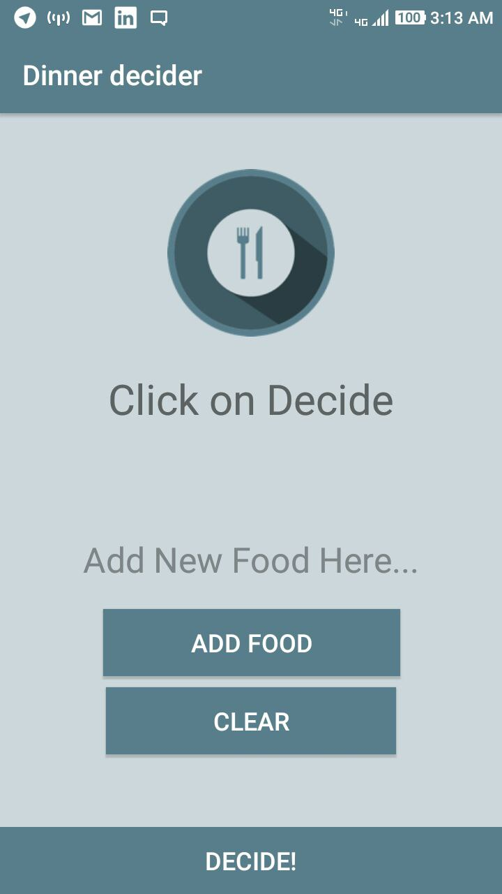

# Food-Decider
Android Application FOoD Decider, buit in kotlin.
It ask from user to enter Some foods in list and than when user click on decide it will choose random food from that list and show it to user on screen.

buit while learning kotlin.
I have added some extra feature.

# Screen Shots </br>


# Source
https://www.youtube.com/watch?v=sZWMPYIkNd8 </br>
https://devslopes.com

Thanks For [Vishal Koshti](https://github.com/vkoshti)

# TO-dO
```
Add a google map feature, like when user click on decide button
the application shows them a food name as well as when user click on that output food name
than application call for google map api and find nearest restrurant where that food is available.
```
